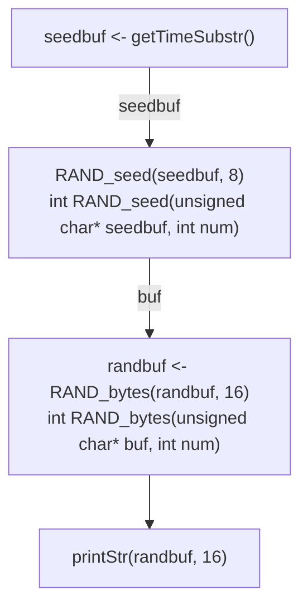

# ch2/mkrand16.c

```mermaid
flowchart TD
    A["seedbuf <- getTimeSubstr()"] -->|"seedbuf"| B["RAND_seed(seedbuf, 8)
int RAND_seed(unsigned char* seedbuf, int num)"]
    B -->|"buf"| C["randbuf <- RAND_bytes(randbuf, 16)
int RAND_bytes(unsigned char* buf, int num)"]
    C --> D["printStr(randbuf, 16)"]
```
