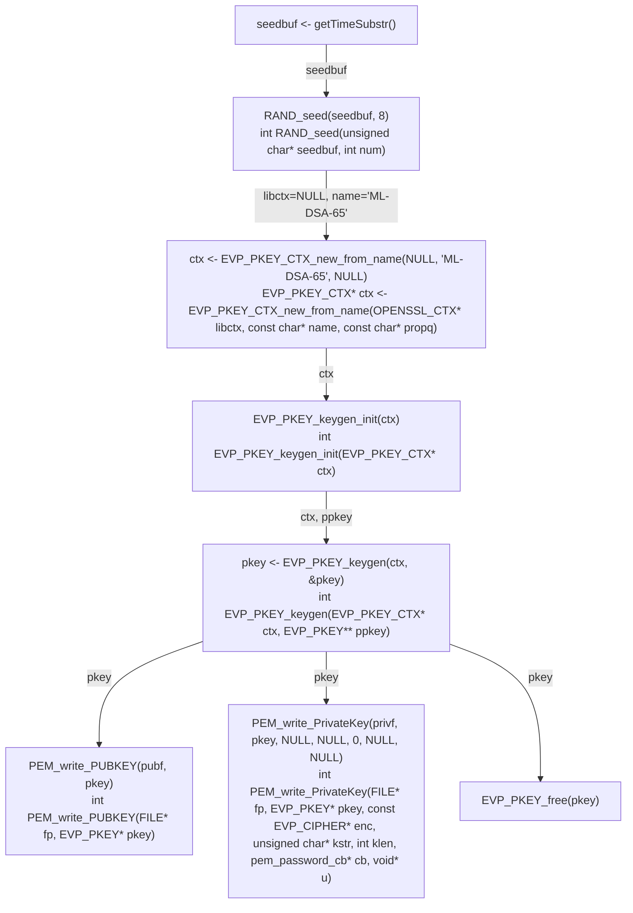

# ch2/pqc/pqc_mldsa_genkey.c

```mermaid
flowchart TD
    A["seedbuf <- getTimeSubstr()"] -->|"seedbuf"| B["RAND_seed(seedbuf, 8)
int RAND_seed(unsigned char* seedbuf, int num)"]
    B -->|"libctx=NULL, name='ML-DSA-65'"| C["ctx <- EVP_PKEY_CTX_new_from_name(NULL, 'ML-DSA-65', NULL)
EVP_PKEY_CTX* ctx <- EVP_PKEY_CTX_new_from_name(OPENSSL_CTX* libctx, const char* name, const char* propq)"]
    C -->|"ctx"| D["EVP_PKEY_keygen_init(ctx)
int EVP_PKEY_keygen_init(EVP_PKEY_CTX* ctx)"]
    D -->|"ctx, ppkey"| E["pkey <- EVP_PKEY_keygen(ctx, &pkey)
int EVP_PKEY_keygen(EVP_PKEY_CTX* ctx, EVP_PKEY** ppkey)"]
    E -->|"pkey"| F["PEM_write_PUBKEY(pubf, pkey)
int PEM_write_PUBKEY(FILE* fp, EVP_PKEY* pkey)"]
    E -->|"pkey"| G["PEM_write_PrivateKey(privf, pkey, NULL, NULL, 0, NULL, NULL)
int PEM_write_PrivateKey(FILE* fp, EVP_PKEY* pkey, const EVP_CIPHER* enc, unsigned char* kstr, int klen, pem_password_cb* cb, void* u)"]
    E -->|"pkey"| H["EVP_PKEY_free(pkey)"]
```
