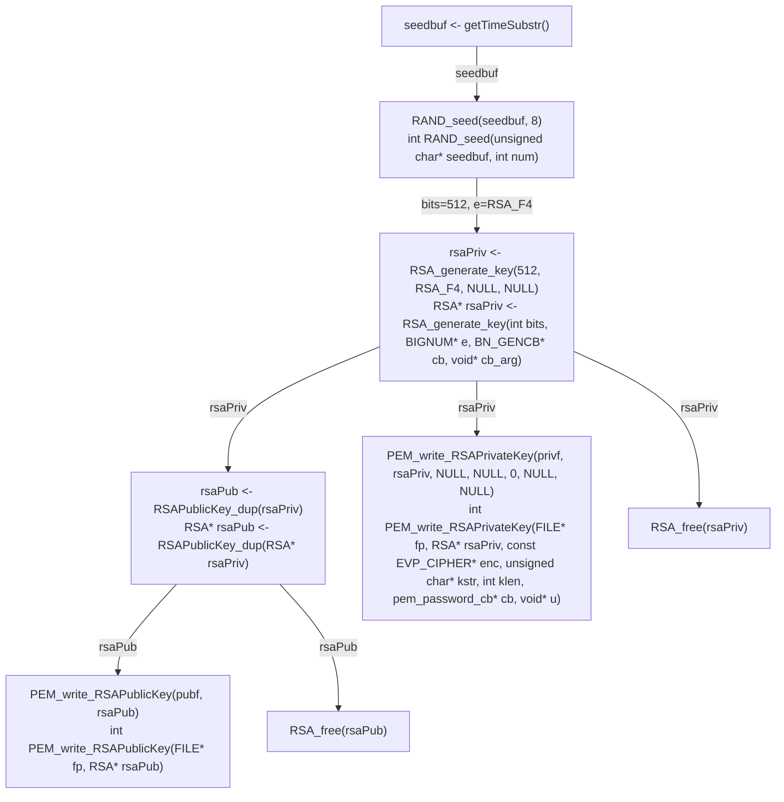

# ch2/rsagenkey.c

```mermaid
flowchart TD
    A["seedbuf <- getTimeSubstr()"] -->|"seedbuf"| B["RAND_seed(seedbuf, 8)
int RAND_seed(unsigned char* seedbuf, int num)"]
    B -->|"bits=512, e=RSA_F4"| C["rsaPriv <- RSA_generate_key(512, RSA_F4, NULL, NULL)
RSA* rsaPriv <- RSA_generate_key(int bits, BIGNUM* e, BN_GENCB* cb, void* cb_arg)"]
    C -->|"rsaPriv"| D["rsaPub <- RSAPublicKey_dup(rsaPriv)
RSA* rsaPub <- RSAPublicKey_dup(RSA* rsaPriv)"]
    D -->|"rsaPub"| E["PEM_write_RSAPublicKey(pubf, rsaPub)
int PEM_write_RSAPublicKey(FILE* fp, RSA* rsaPub)"]
    C -->|"rsaPriv"| F["PEM_write_RSAPrivateKey(privf, rsaPriv, NULL, NULL, 0, NULL, NULL)
int PEM_write_RSAPrivateKey(FILE* fp, RSA* rsaPriv, const EVP_CIPHER* enc, unsigned char* kstr, int klen, pem_password_cb* cb, void* u)"]
    C -->|"rsaPriv"| G["RSA_free(rsaPriv)"]
    D -->|"rsaPub"| H["RSA_free(rsaPub)"]
```
