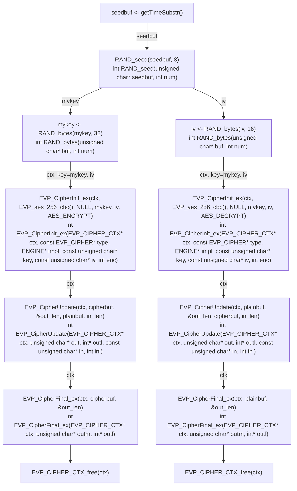

# ch3/pqc/pqc_aes_256_cbc.c

```mermaid
flowchart TD
    A["seedbuf <- getTimeSubstr()"] -->|"seedbuf"| B["RAND_seed(seedbuf, 8)
int RAND_seed(unsigned char* seedbuf, int num)"]
    B -->|"mykey"| C["mykey <- RAND_bytes(mykey, 32)
int RAND_bytes(unsigned char* buf, int num)"]
    B -->|"iv"| D["iv <- RAND_bytes(iv, 16)
int RAND_bytes(unsigned char* buf, int num)"]
    C -->|"ctx, key=mykey, iv"| E["EVP_CipherInit_ex(ctx, EVP_aes_256_cbc(), NULL, mykey, iv, AES_ENCRYPT)
int EVP_CipherInit_ex(EVP_CIPHER_CTX* ctx, const EVP_CIPHER* type, ENGINE* impl, const unsigned char* key, const unsigned char* iv, int enc)"]
    E -->|"ctx"| F["EVP_CipherUpdate(ctx, cipherbuf, &out_len, plainbuf, in_len)
int EVP_CipherUpdate(EVP_CIPHER_CTX* ctx, unsigned char* out, int* outl, const unsigned char* in, int inl)"]
    F -->|"ctx"| G["EVP_CipherFinal_ex(ctx, cipherbuf, &out_len)
int EVP_CipherFinal_ex(EVP_CIPHER_CTX* ctx, unsigned char* outm, int* outl)"]
    G --> H["EVP_CIPHER_CTX_free(ctx)"]
    D -->|"ctx, key=mykey, iv"| I["EVP_CipherInit_ex(ctx, EVP_aes_256_cbc(), NULL, mykey, iv, AES_DECRYPT)
int EVP_CipherInit_ex(EVP_CIPHER_CTX* ctx, const EVP_CIPHER* type, ENGINE* impl, const unsigned char* key, const unsigned char* iv, int enc)"]
    I -->|"ctx"| J["EVP_CipherUpdate(ctx, plainbuf, &out_len, cipherbuf, in_len)
int EVP_CipherUpdate(EVP_CIPHER_CTX* ctx, unsigned char* out, int* outl, const unsigned char* in, int inl)"]
    J -->|"ctx"| K["EVP_CipherFinal_ex(ctx, plainbuf, &out_len)
int EVP_CipherFinal_ex(EVP_CIPHER_CTX* ctx, unsigned char* outm, int* outl)"]
    K --> L["EVP_CIPHER_CTX_free(ctx)"]
```
