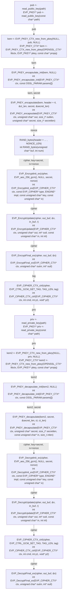

# ch4/pqc/pqc_mlkem_envelope.c

```mermaid
flowchart TD
    A["pub <- read_public_key(path)
EVP_PKEY* pub <- read_public_key(const char* path)"] -->|"pub"| B["kem <- EVP_PKEY_CTX_new_from_pkey(NULL, pub, NULL)
EVP_PKEY_CTX* kem <- EVP_PKEY_CTX_new_from_pkey(OPENSSL_CTX* libctx, EVP_PKEY* pkey, const char* propq)"]
    B -->|"kem"| C["EVP_PKEY_encapsulate_init(kem, NULL)
int EVP_PKEY_encapsulate_init(EVP_PKEY_CTX* ctx, const OSSL_PARAM params[])"]
    C -->|"kem, secret"| D["EVP_PKEY_encapsulate(kem, header + 4, &ct_len, secret, &secret_len)
int EVP_PKEY_encapsulate(EVP_PKEY_CTX* ctx, unsigned char* out, size_t* outlen, unsigned char* secret, size_t* secretlen)"]
    D -->|"nonce"| E["RAND_bytes(header + ... , NONCE_LEN)
int RAND_bytes(unsigned char* buf, int num)"]
    E -->|"cipher, key=secret, iv=nonce"| F["EVP_EncryptInit_ex(cipher, EVP_aes_256_gcm(), NULL, secret, nonce)
int EVP_EncryptInit_ex(EVP_CIPHER_CTX* ctx, const EVP_CIPHER* type, ENGINE* impl, const unsigned char* key, const unsigned char* iv)"]
    F -->|"cipher"| G["EVP_EncryptUpdate(cipher, out_buf, &n, in_buf, r)
int EVP_EncryptUpdate(EVP_CIPHER_CTX* ctx, unsigned char* out, int* outl, const unsigned char* in, int inl)"]
    G -->|"cipher"| H["EVP_EncryptFinal_ex(cipher, out_buf, &n)
int EVP_EncryptFinal_ex(EVP_CIPHER_CTX* ctx, unsigned char* outm, int* outl)"]
    H -->|"tag"| I["EVP_CIPHER_CTX_ctrl(cipher, EVP_CTRL_GCM_GET_TAG, TAG_LEN, tag)
int EVP_CIPHER_CTX_ctrl(EVP_CIPHER_CTX* ctx, int cmd, int p1, void* p2)"]
    I -->|"priv"| J["priv <- read_private_key(path)
EVP_PKEY* priv <- read_private_key(const char* path)"]
    J -->|"priv"| K["kem2 <- EVP_PKEY_CTX_new_from_pkey(NULL, priv, NULL)
EVP_PKEY_CTX* kem2 <- EVP_PKEY_CTX_new_from_pkey(OPENSSL_CTX* libctx, EVP_PKEY* pkey, const char* propq)"]
    K -->|"kem2"| L["EVP_PKEY_decapsulate_init(kem2, NULL)
int EVP_PKEY_decapsulate_init(EVP_PKEY_CTX* ctx, const OSSL_PARAM params[])"]
    L -->|"kem2, secret"| M["EVP_PKEY_decapsulate(kem2, secret, &secret_len, ct, ct_len)
int EVP_PKEY_decapsulate(EVP_PKEY_CTX* ctx, unsigned char* secret, size_t* secretlen, const unsigned char* in, size_t inlen)"]
    M -->|"cipher, key=secret, iv=nonce"| N["EVP_DecryptInit_ex(cipher, EVP_aes_256_gcm(), NULL, secret, nonce)
int EVP_DecryptInit_ex(EVP_CIPHER_CTX* ctx, const EVP_CIPHER* type, ENGINE* impl, const unsigned char* key, const unsigned char* iv)"]
    N -->|"cipher"| O["EVP_DecryptUpdate(cipher, out_buf, &n, in_buf, r)
int EVP_DecryptUpdate(EVP_CIPHER_CTX* ctx, unsigned char* out, int* outl, const unsigned char* in, int inl)"]
    O -->|"cipher"| P["EVP_CIPHER_CTX_ctrl(cipher, EVP_CTRL_GCM_SET_TAG, TAG_LEN, tag)
int EVP_CIPHER_CTX_ctrl(EVP_CIPHER_CTX* ctx, int cmd, int p1, void* p2)"]
    P -->|"cipher"| Q["EVP_DecryptFinal_ex(cipher, out_buf, &n)
int EVP_DecryptFinal_ex(EVP_CIPHER_CTX* ctx, unsigned char* outm, int* outl)"]
```
