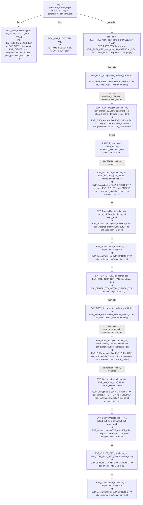

# ch4/pqc/pqc_mlkem_file.c

```mermaid
flowchart TD
    A["key <- generate_mlkem_key()
EVP_PKEY* key <- generate_mlkem_key(void)"] -->|"key"| B["PEM_write_PrivateKey(file, key, NULL, NULL, 0, NULL, NULL)
int PEM_write_PrivateKey(FILE* fp, EVP_PKEY* pkey, const EVP_CIPHER* enc, unsigned char* kstr, int klen, pem_password_cb* cb, void* u)"]
    A -->|"key"| C["PEM_write_PUBKEY(file, key)
int PEM_write_PUBKEY(FILE* fp, EVP_PKEY* pkey)"]
    A -->|"pkey=key"| D["kem_ctx <- EVP_PKEY_CTX_new_from_pkey(NULL, key, NULL)
EVP_PKEY_CTX* kem_ctx <- EVP_PKEY_CTX_new_from_pkey(OPENSSL_CTX* libctx, EVP_PKEY* pkey, const char* propq)"]
    D -->|"kem_ctx"| E["EVP_PKEY_encapsulate_init(kem_ctx, NULL)
int EVP_PKEY_encapsulate_init(EVP_PKEY_CTX* ctx, const OSSL_PARAM params[])"]
    E -->|"kem_ctx, out=kem_ciphertext, secret=shared_secret"| F["EVP_PKEY_encapsulate(kem_ctx, kem_ciphertext, &kem_ciphertext_len, shared_secret, &shared_secret_len)
int EVP_PKEY_encapsulate(EVP_PKEY_CTX* ctx, unsigned char* out, size_t* outlen, unsigned char* secret, size_t* secretlen)"]
    F -->|"nonce"| G["RAND_bytes(nonce, sizeof(nonce))
int RAND_bytes(unsigned char* buf, int num)"]
    G -->|"key=shared_secret, iv=nonce"| H["EVP_EncryptInit_ex(cipher_ctx, EVP_aes_256_gcm(), NULL, shared_secret, nonce)
int EVP_EncryptInit_ex(EVP_CIPHER_CTX* ctx, const EVP_CIPHER* type, ENGINE* impl, const unsigned char* key, const unsigned char* iv)"]
    H -->|"ctx"| I["EVP_EncryptUpdate(cipher_ctx, output_buf, &out_len, input_buf, bytes_read)
int EVP_EncryptUpdate(EVP_CIPHER_CTX* ctx, unsigned char* out, int* outl, const unsigned char* in, int inl)"]
    I -->|"ctx"| J["EVP_EncryptFinal_ex(cipher_ctx, output_buf, &final_len)
int EVP_EncryptFinal_ex(EVP_CIPHER_CTX* ctx, unsigned char* outm, int* outl)"]
    J -->|"ctx"| K["EVP_CIPHER_CTX_ctrl(cipher_ctx, EVP_CTRL_GCM_GET_TAG, sizeof(tag), tag)
int EVP_CIPHER_CTX_ctrl(EVP_CIPHER_CTX* ctx, int cmd, int p1, void* p2)"]
    K -->|"kem_ctx"| L["EVP_PKEY_decapsulate_init(kem_ctx, NULL)
int EVP_PKEY_decapsulate_init(EVP_PKEY_CTX* ctx, const OSSL_PARAM params[])"]
    L -->|"kem_ctx, in=kem_ciphertext, secret=shared_secret"| M["EVP_PKEY_decapsulate(kem_ctx, shared_secret, &shared_secret_len, kem_ciphertext, kem_ciphertext_len)
int EVP_PKEY_decapsulate(EVP_PKEY_CTX* ctx, unsigned char* secret, size_t* secretlen, const unsigned char* in, size_t inlen)"]
    M -->|"key=shared_secret, iv=nonce"| N["EVP_DecryptInit_ex(cipher_ctx, EVP_aes_256_gcm(), NULL, shared_secret, nonce)
int EVP_DecryptInit_ex(EVP_CIPHER_CTX* ctx, const EVP_CIPHER* type, ENGINE* impl, const unsigned char* key, const unsigned char* iv)"]
    N -->|"ctx"| O["EVP_DecryptUpdate(cipher_ctx, output_buf, &out_len, input_buf, bytes_read)
int EVP_DecryptUpdate(EVP_CIPHER_CTX* ctx, unsigned char* out, int* outl, const unsigned char* in, int inl)"]
    O -->|"ctx"| P["EVP_CIPHER_CTX_ctrl(cipher_ctx, EVP_CTRL_GCM_SET_TAG, sizeof(tag), tag)
int EVP_CIPHER_CTX_ctrl(EVP_CIPHER_CTX* ctx, int cmd, int p1, void* p2)"]
    P -->|"ctx"| Q["EVP_DecryptFinal_ex(cipher_ctx, output_buf, &final_len)
int EVP_DecryptFinal_ex(EVP_CIPHER_CTX* ctx, unsigned char* outm, int* outl)"]
```
