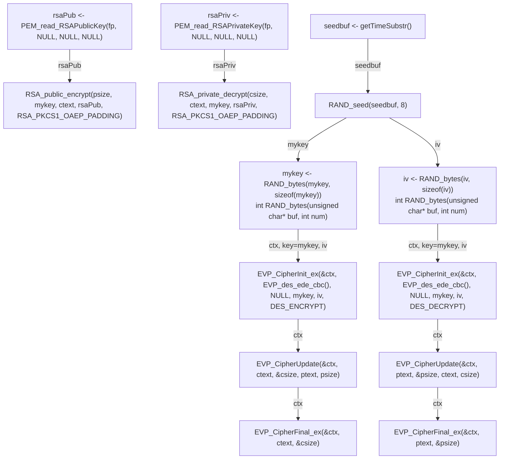

# ch4/rsa_des_crc.c

```mermaid
flowchart TD
    A["rsaPub <- PEM_read_RSAPublicKey(fp, NULL, NULL, NULL)"] -->|"rsaPub"| B["RSA_public_encrypt(psize, mykey, ctext, rsaPub, RSA_PKCS1_OAEP_PADDING)"]
    C["rsaPriv <- PEM_read_RSAPrivateKey(fp, NULL, NULL, NULL)"] -->|"rsaPriv"| D["RSA_private_decrypt(csize, ctext, mykey, rsaPriv, RSA_PKCS1_OAEP_PADDING)"]
    E["seedbuf <- getTimeSubstr()"] -->|"seedbuf"| F["RAND_seed(seedbuf, 8)"]
    F -->|"mykey"| G["mykey <- RAND_bytes(mykey, sizeof(mykey))
int RAND_bytes(unsigned char* buf, int num)"]
    F -->|"iv"| H["iv <- RAND_bytes(iv, sizeof(iv))
int RAND_bytes(unsigned char* buf, int num)"]
    G -->|"ctx, key=mykey, iv"| I["EVP_CipherInit_ex(&ctx, EVP_des_ede_cbc(), NULL, mykey, iv, DES_ENCRYPT)"]
    I -->|"ctx"| J["EVP_CipherUpdate(&ctx, ctext, &csize, ptext, psize)"]
    J -->|"ctx"| K["EVP_CipherFinal_ex(&ctx, ctext, &csize)"]
    H -->|"ctx, key=mykey, iv"| L["EVP_CipherInit_ex(&ctx, EVP_des_ede_cbc(), NULL, mykey, iv, DES_DECRYPT)"]
    L -->|"ctx"| M["EVP_CipherUpdate(&ctx, ptext, &psize, ctext, csize)"]
    M -->|"ctx"| N["EVP_CipherFinal_ex(&ctx, ptext, &psize)"]
```
