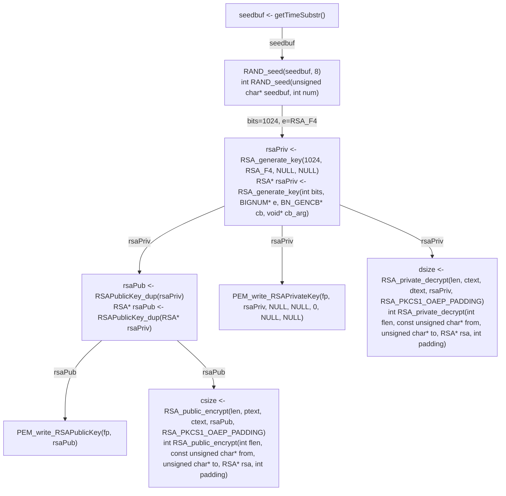

# ch4/rsatest.c

```mermaid
flowchart TD
    A["seedbuf <- getTimeSubstr()"] -->|"seedbuf"| B["RAND_seed(seedbuf, 8)
int RAND_seed(unsigned char* seedbuf, int num)"]
    B -->|"bits=1024, e=RSA_F4"| C["rsaPriv <- RSA_generate_key(1024, RSA_F4, NULL, NULL)
RSA* rsaPriv <- RSA_generate_key(int bits, BIGNUM* e, BN_GENCB* cb, void* cb_arg)"]
    C -->|"rsaPriv"| D["rsaPub <- RSAPublicKey_dup(rsaPriv)
RSA* rsaPub <- RSAPublicKey_dup(RSA* rsaPriv)"]
    D -->|"rsaPub"| E["PEM_write_RSAPublicKey(fp, rsaPub)"]
    C -->|"rsaPriv"| F["PEM_write_RSAPrivateKey(fp, rsaPriv, NULL, NULL, 0, NULL, NULL)"]
    D -->|"rsaPub"| G["csize <- RSA_public_encrypt(len, ptext, ctext, rsaPub, RSA_PKCS1_OAEP_PADDING)
int RSA_public_encrypt(int flen, const unsigned char* from, unsigned char* to, RSA* rsa, int padding)"]
    C -->|"rsaPriv"| H["dsize <- RSA_private_decrypt(len, ctext, dtext, rsaPriv, RSA_PKCS1_OAEP_PADDING)
int RSA_private_decrypt(int flen, const unsigned char* from, unsigned char* to, RSA* rsa, int padding)"]
```
