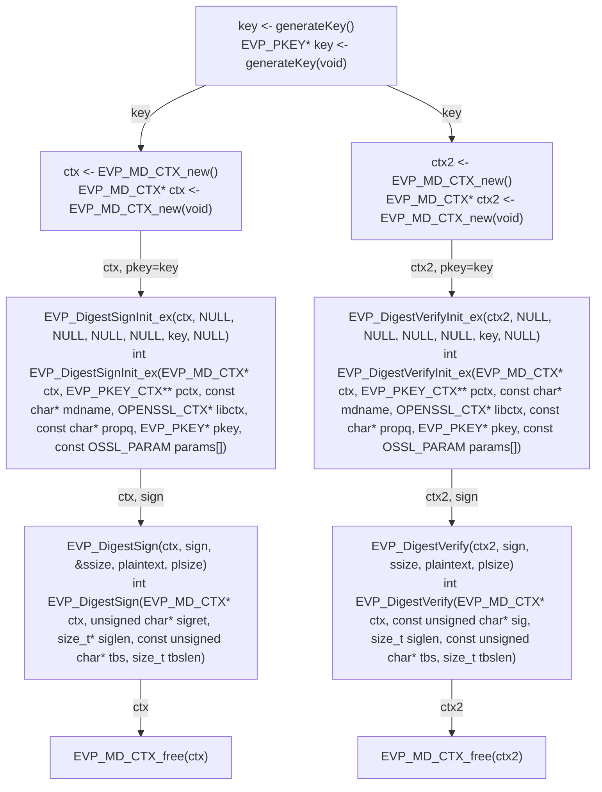

# ch5/pqc/pqc_mldsa_sign_test.c

```mermaid
flowchart TD
    A["key <- generateKey()
EVP_PKEY* key <- generateKey(void)"] -->|"key"| B["ctx <- EVP_MD_CTX_new()
EVP_MD_CTX* ctx <- EVP_MD_CTX_new(void)"]
    B -->|"ctx, pkey=key"| C["EVP_DigestSignInit_ex(ctx, NULL, NULL, NULL, NULL, key, NULL)
int EVP_DigestSignInit_ex(EVP_MD_CTX* ctx, EVP_PKEY_CTX** pctx, const char* mdname, OPENSSL_CTX* libctx, const char* propq, EVP_PKEY* pkey, const OSSL_PARAM params[])"]
    C -->|"ctx, sign"| D["EVP_DigestSign(ctx, sign, &ssize, plaintext, plsize)
int EVP_DigestSign(EVP_MD_CTX* ctx, unsigned char* sigret, size_t* siglen, const unsigned char* tbs, size_t tbslen)"]
    D -->|"ctx"| E["EVP_MD_CTX_free(ctx)"]
    A -->|"key"| F["ctx2 <- EVP_MD_CTX_new()
EVP_MD_CTX* ctx2 <- EVP_MD_CTX_new(void)"]
    F -->|"ctx2, pkey=key"| G["EVP_DigestVerifyInit_ex(ctx2, NULL, NULL, NULL, NULL, key, NULL)
int EVP_DigestVerifyInit_ex(EVP_MD_CTX* ctx, EVP_PKEY_CTX** pctx, const char* mdname, OPENSSL_CTX* libctx, const char* propq, EVP_PKEY* pkey, const OSSL_PARAM params[])"]
    G -->|"ctx2, sign"| H["EVP_DigestVerify(ctx2, sign, ssize, plaintext, plsize)
int EVP_DigestVerify(EVP_MD_CTX* ctx, const unsigned char* sig, size_t siglen, const unsigned char* tbs, size_t tbslen)"]
    H -->|"ctx2"| I["EVP_MD_CTX_free(ctx2)"]
```
