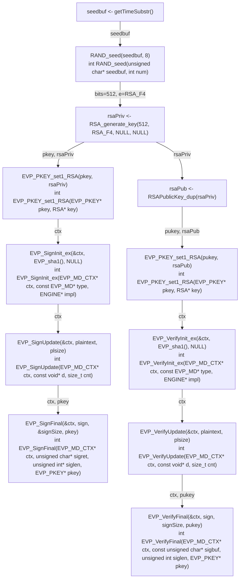

# ch5/rsa_sha1_sign_test.c

```mermaid
flowchart TD
    A["seedbuf <- getTimeSubstr()"] -->|"seedbuf"| B["RAND_seed(seedbuf, 8)
int RAND_seed(unsigned char* seedbuf, int num)"]
    B -->|"bits=512, e=RSA_F4"| C["rsaPriv <- RSA_generate_key(512, RSA_F4, NULL, NULL)"]
    C -->|"rsaPriv"| D["rsaPub <- RSAPublicKey_dup(rsaPriv)"]
    C -->|"pkey, rsaPriv"| E["EVP_PKEY_set1_RSA(pkey, rsaPriv)
int EVP_PKEY_set1_RSA(EVP_PKEY* pkey, RSA* key)"]
    E -->|"ctx"| F["EVP_SignInit_ex(&ctx, EVP_sha1(), NULL)
int EVP_SignInit_ex(EVP_MD_CTX* ctx, const EVP_MD* type, ENGINE* impl)"]
    F -->|"ctx"| G["EVP_SignUpdate(&ctx, plaintext, plsize)
int EVP_SignUpdate(EVP_MD_CTX* ctx, const void* d, size_t cnt)"]
    G -->|"ctx, pkey"| H["EVP_SignFinal(&ctx, sign, &signSize, pkey)
int EVP_SignFinal(EVP_MD_CTX* ctx, unsigned char* sigret, unsigned int* siglen, EVP_PKEY* pkey)"]
    D -->|"pukey, rsaPub"| I["EVP_PKEY_set1_RSA(pukey, rsaPub)
int EVP_PKEY_set1_RSA(EVP_PKEY* pkey, RSA* key)"]
    I -->|"ctx"| J["EVP_VerifyInit_ex(&ctx, EVP_sha1(), NULL)
int EVP_VerifyInit_ex(EVP_MD_CTX* ctx, const EVP_MD* type, ENGINE* impl)"]
    J -->|"ctx"| K["EVP_VerifyUpdate(&ctx, plaintext, plsize)
int EVP_VerifyUpdate(EVP_MD_CTX* ctx, const void* d, size_t cnt)"]
    K -->|"ctx, pukey"| L["EVP_VerifyFinal(&ctx, sign, signSize, pukey)
int EVP_VerifyFinal(EVP_MD_CTX* ctx, const unsigned char* sigbuf, unsigned int siglen, EVP_PKEY* pkey)"]
```
