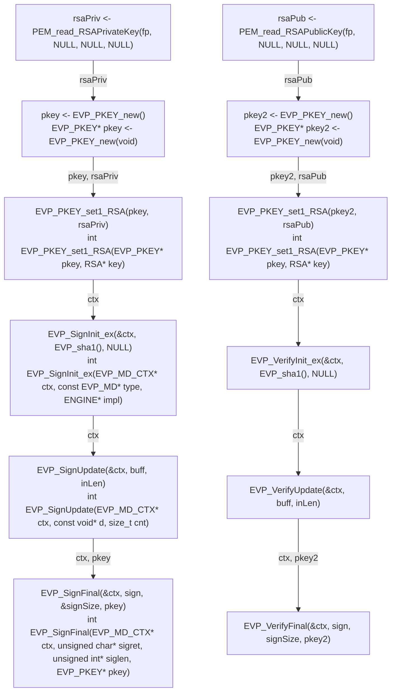

# ch7/hash_sign.c

```mermaid
flowchart TD
    A["rsaPriv <- PEM_read_RSAPrivateKey(fp, NULL, NULL, NULL)"] -->|"rsaPriv"| B["pkey <- EVP_PKEY_new()
EVP_PKEY* pkey <- EVP_PKEY_new(void)"]
    B -->|"pkey, rsaPriv"| C["EVP_PKEY_set1_RSA(pkey, rsaPriv)
int EVP_PKEY_set1_RSA(EVP_PKEY* pkey, RSA* key)"]
    C -->|"ctx"| D["EVP_SignInit_ex(&ctx, EVP_sha1(), NULL)
int EVP_SignInit_ex(EVP_MD_CTX* ctx, const EVP_MD* type, ENGINE* impl)"]
    D -->|"ctx"| E["EVP_SignUpdate(&ctx, buff, inLen)
int EVP_SignUpdate(EVP_MD_CTX* ctx, const void* d, size_t cnt)"]
    E -->|"ctx, pkey"| F["EVP_SignFinal(&ctx, sign, &signSize, pkey)
int EVP_SignFinal(EVP_MD_CTX* ctx, unsigned char* sigret, unsigned int* siglen, EVP_PKEY* pkey)"]
    G["rsaPub <- PEM_read_RSAPublicKey(fp, NULL, NULL, NULL)"] -->|"rsaPub"| H["pkey2 <- EVP_PKEY_new()
EVP_PKEY* pkey2 <- EVP_PKEY_new(void)"]
    H -->|"pkey2, rsaPub"| I["EVP_PKEY_set1_RSA(pkey2, rsaPub)
int EVP_PKEY_set1_RSA(EVP_PKEY* pkey, RSA* key)"]
    I -->|"ctx"| J["EVP_VerifyInit_ex(&ctx, EVP_sha1(), NULL)"]
    J -->|"ctx"| K["EVP_VerifyUpdate(&ctx, buff, inLen)"]
    K -->|"ctx, pkey2"| L["EVP_VerifyFinal(&ctx, sign, signSize, pkey2)"]
```
