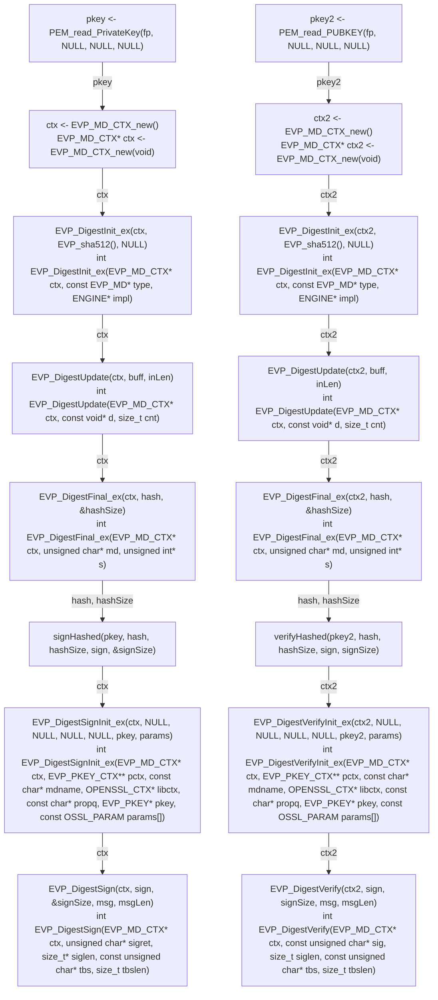

# ch7/pqc/pqc_hash_sign.c

```mermaid
flowchart TD
    A["pkey <- PEM_read_PrivateKey(fp, NULL, NULL, NULL)"] -->|"pkey"| B["ctx <- EVP_MD_CTX_new()
EVP_MD_CTX* ctx <- EVP_MD_CTX_new(void)"]
    B -->|"ctx"| C["EVP_DigestInit_ex(ctx, EVP_sha512(), NULL)
int EVP_DigestInit_ex(EVP_MD_CTX* ctx, const EVP_MD* type, ENGINE* impl)"]
    C -->|"ctx"| D["EVP_DigestUpdate(ctx, buff, inLen)
int EVP_DigestUpdate(EVP_MD_CTX* ctx, const void* d, size_t cnt)"]
    D -->|"ctx"| E["EVP_DigestFinal_ex(ctx, hash, &hashSize)
int EVP_DigestFinal_ex(EVP_MD_CTX* ctx, unsigned char* md, unsigned int* s)"]
    E -->|"hash, hashSize"| F["signHashed(pkey, hash, hashSize, sign, &signSize)"]
    F -->|"ctx"| G["EVP_DigestSignInit_ex(ctx, NULL, NULL, NULL, NULL, pkey, params)
int EVP_DigestSignInit_ex(EVP_MD_CTX* ctx, EVP_PKEY_CTX** pctx, const char* mdname, OPENSSL_CTX* libctx, const char* propq, EVP_PKEY* pkey, const OSSL_PARAM params[])"]
    G -->|"ctx"| H["EVP_DigestSign(ctx, sign, &signSize, msg, msgLen)
int EVP_DigestSign(EVP_MD_CTX* ctx, unsigned char* sigret, size_t* siglen, const unsigned char* tbs, size_t tbslen)"]
    I["pkey2 <- PEM_read_PUBKEY(fp, NULL, NULL, NULL)"] -->|"pkey2"| J["ctx2 <- EVP_MD_CTX_new()
EVP_MD_CTX* ctx2 <- EVP_MD_CTX_new(void)"]
    J -->|"ctx2"| K["EVP_DigestInit_ex(ctx2, EVP_sha512(), NULL)
int EVP_DigestInit_ex(EVP_MD_CTX* ctx, const EVP_MD* type, ENGINE* impl)"]
    K -->|"ctx2"| L["EVP_DigestUpdate(ctx2, buff, inLen)
int EVP_DigestUpdate(EVP_MD_CTX* ctx, const void* d, size_t cnt)"]
    L -->|"ctx2"| M["EVP_DigestFinal_ex(ctx2, hash, &hashSize)
int EVP_DigestFinal_ex(EVP_MD_CTX* ctx, unsigned char* md, unsigned int* s)"]
    M -->|"hash, hashSize"| N["verifyHashed(pkey2, hash, hashSize, sign, signSize)"]
    N -->|"ctx2"| O["EVP_DigestVerifyInit_ex(ctx2, NULL, NULL, NULL, NULL, pkey2, params)
int EVP_DigestVerifyInit_ex(EVP_MD_CTX* ctx, EVP_PKEY_CTX** pctx, const char* mdname, OPENSSL_CTX* libctx, const char* propq, EVP_PKEY* pkey, const OSSL_PARAM params[])"]
    O -->|"ctx2"| P["EVP_DigestVerify(ctx2, sign, signSize, msg, msgLen)
int EVP_DigestVerify(EVP_MD_CTX* ctx, const unsigned char* sig, size_t siglen, const unsigned char* tbs, size_t tbslen)"]
```
