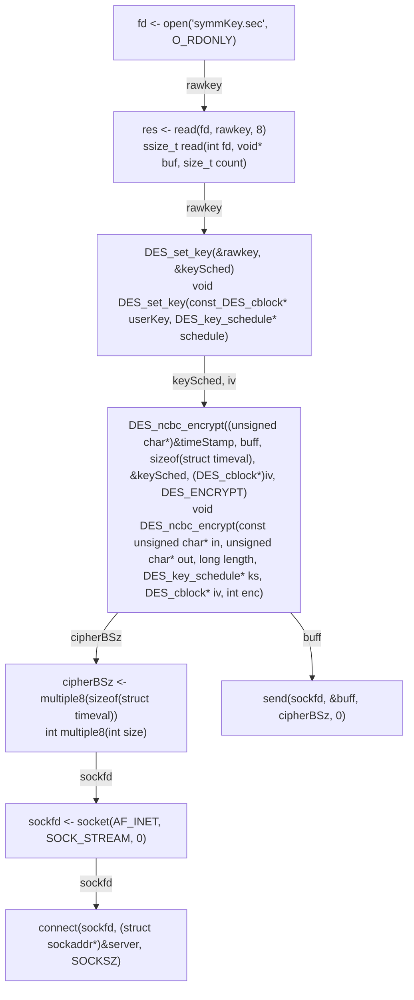

# ch8/client0.c

```mermaid
flowchart TD
    A["fd <- open('symmKey.sec', O_RDONLY)"] -->|"rawkey"| B["res <- read(fd, rawkey, 8)
ssize_t read(int fd, void* buf, size_t count)"]
    B -->|"rawkey"| C["DES_set_key(&rawkey, &keySched)
void DES_set_key(const_DES_cblock* userKey, DES_key_schedule* schedule)"]
    C -->|"keySched, iv"| D["DES_ncbc_encrypt((unsigned char*)&timeStamp, buff, sizeof(struct timeval), &keySched, (DES_cblock*)iv, DES_ENCRYPT)
void DES_ncbc_encrypt(const unsigned char* in, unsigned char* out, long length, DES_key_schedule* ks, DES_cblock* iv, int enc)"]
    D -->|"cipherBSz"| E["cipherBSz <- multiple8(sizeof(struct timeval))
int multiple8(int size)"]
    E -->|"sockfd"| F["sockfd <- socket(AF_INET, SOCK_STREAM, 0)"]
    F -->|"sockfd"| G["connect(sockfd, (struct sockaddr*)&server, SOCKSZ)"]
    D -->|"buff"| H["send(sockfd, &buff, cipherBSz, 0)"]
```
