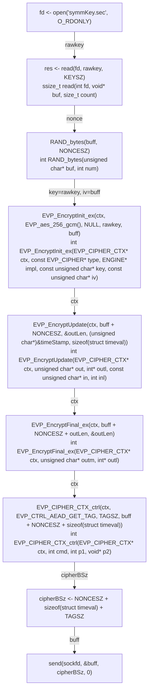

# ch8/pqc/pqc_client0.c

```mermaid
flowchart TD
    A["fd <- open('symmKey.sec', O_RDONLY)"] -->|"rawkey"| B["res <- read(fd, rawkey, KEYSZ)
ssize_t read(int fd, void* buf, size_t count)"]
    B -->|"nonce"| C["RAND_bytes(buff, NONCESZ)
int RAND_bytes(unsigned char* buf, int num)"]
    C -->|"key=rawkey, iv=buff"| D["EVP_EncryptInit_ex(ctx, EVP_aes_256_gcm(), NULL, rawkey, buff)
int EVP_EncryptInit_ex(EVP_CIPHER_CTX* ctx, const EVP_CIPHER* type, ENGINE* impl, const unsigned char* key, const unsigned char* iv)"]
    D -->|"ctx"| E["EVP_EncryptUpdate(ctx, buff + NONCESZ, &outLen, (unsigned char*)&timeStamp, sizeof(struct timeval))
int EVP_EncryptUpdate(EVP_CIPHER_CTX* ctx, unsigned char* out, int* outl, const unsigned char* in, int inl)"]
    E -->|"ctx"| F["EVP_EncryptFinal_ex(ctx, buff + NONCESZ + outLen, &outLen)
int EVP_EncryptFinal_ex(EVP_CIPHER_CTX* ctx, unsigned char* outm, int* outl)"]
    F -->|"ctx"| G["EVP_CIPHER_CTX_ctrl(ctx, EVP_CTRL_AEAD_GET_TAG, TAGSZ, buff + NONCESZ + sizeof(struct timeval))
int EVP_CIPHER_CTX_ctrl(EVP_CIPHER_CTX* ctx, int cmd, int p1, void* p2)"]
    G -->|"cipherBSz"| H["cipherBSz <- NONCESZ + sizeof(struct timeval) + TAGSZ"]
    H -->|"buff"| I["send(sockfd, &buff, cipherBSz, 0)"]
```
