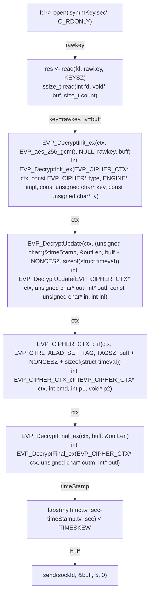

# ch8/pqc/pqc_server0.c

```mermaid
flowchart TD
    A["fd <- open('symmKey.sec', O_RDONLY)"] -->|"rawkey"| B["res <- read(fd, rawkey, KEYSZ)
ssize_t read(int fd, void* buf, size_t count)"]
    B -->|"key=rawkey, iv=buff"| C["EVP_DecryptInit_ex(ctx, EVP_aes_256_gcm(), NULL, rawkey, buff)
int EVP_DecryptInit_ex(EVP_CIPHER_CTX* ctx, const EVP_CIPHER* type, ENGINE* impl, const unsigned char* key, const unsigned char* iv)"]
    C -->|"ctx"| D["EVP_DecryptUpdate(ctx, (unsigned char*)&timeStamp, &outLen, buff + NONCESZ, sizeof(struct timeval))
int EVP_DecryptUpdate(EVP_CIPHER_CTX* ctx, unsigned char* out, int* outl, const unsigned char* in, int inl)"]
    D -->|"ctx"| E["EVP_CIPHER_CTX_ctrl(ctx, EVP_CTRL_AEAD_SET_TAG, TAGSZ, buff + NONCESZ + sizeof(struct timeval))
int EVP_CIPHER_CTX_ctrl(EVP_CIPHER_CTX* ctx, int cmd, int p1, void* p2)"]
    E -->|"ctx"| F["EVP_DecryptFinal_ex(ctx, buff, &outLen)
int EVP_DecryptFinal_ex(EVP_CIPHER_CTX* ctx, unsigned char* outm, int* outl)"]
    F -->|"timeStamp"| G["labs(myTime.tv_sec-timeStamp.tv_sec) < TIMESKEW"]
    G -->|"buff"| H["send(sockfd, &buff, 5, 0)"]
```
