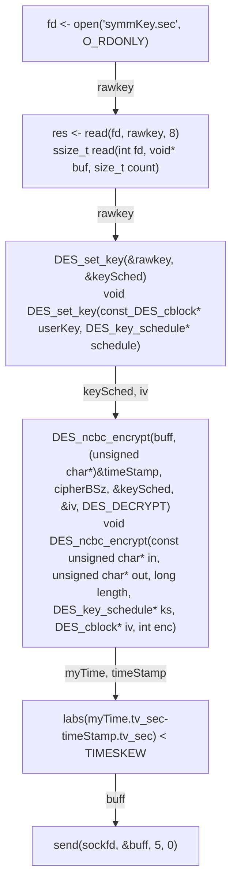

# ch8/server0.c

```mermaid
flowchart TD
    A["fd <- open('symmKey.sec', O_RDONLY)"] -->|"rawkey"| B["res <- read(fd, rawkey, 8)
ssize_t read(int fd, void* buf, size_t count)"]
    B -->|"rawkey"| C["DES_set_key(&rawkey, &keySched)
void DES_set_key(const_DES_cblock* userKey, DES_key_schedule* schedule)"]
    C -->|"keySched, iv"| D["DES_ncbc_encrypt(buff, (unsigned char*)&timeStamp, cipherBSz, &keySched, &iv, DES_DECRYPT)
void DES_ncbc_encrypt(const unsigned char* in, unsigned char* out, long length, DES_key_schedule* ks, DES_cblock* iv, int enc)"]
    D -->|"myTime, timeStamp"| E["labs(myTime.tv_sec-timeStamp.tv_sec) < TIMESKEW"]
    E -->|"buff"| F["send(sockfd, &buff, 5, 0)"]
```
