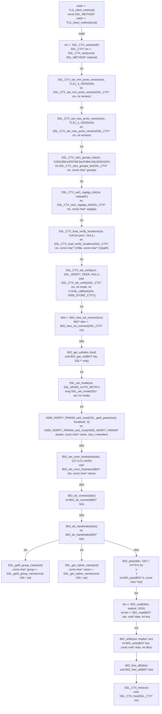

# ch9/pqc/pqc_ssl_client.c

```mermaid
flowchart TD
    A["meth <- TLS_client_method()
const SSL_METHOD* meth <- TLS_client_method(void)"] -->|"meth"| B["ctx <- SSL_CTX_new(meth)
SSL_CTX* ctx <- SSL_CTX_new(const SSL_METHOD* method)"]
    B -->|"ctx"| C["SSL_CTX_set_min_proto_version(ctx, TLS1_3_VERSION)
int SSL_CTX_set_min_proto_version(SSL_CTX* ctx, int version)"]
    C -->|"ctx"| D["SSL_CTX_set_max_proto_version(ctx, TLS1_3_VERSION)
int SSL_CTX_set_max_proto_version(SSL_CTX* ctx, int version)"]
    D -->|"ctx"| E["SSL_CTX_set1_groups_list(ctx, 'X25519MLKEM768:SecP384r1MLKEM1024')
int SSL_CTX_set1_groups_list(SSL_CTX* ctx, const char* groups)"]
    E -->|"ctx"| F["SSL_CTX_set1_sigalgs_list(ctx, 'mldsa65')
int SSL_CTX_set1_sigalgs_list(SSL_CTX* ctx, const char* sigalgs)"]
    F -->|"ctx"| G["SSL_CTX_load_verify_locations(ctx, 'CACert.pem', NULL)
int SSL_CTX_load_verify_locations(SSL_CTX* ctx, const char* CAfile, const char* CApath)"]
    G -->|"ctx"| H["SSL_CTX_set_verify(ctx, SSL_VERIFY_PEER, NULL)
void SSL_CTX_set_verify(SSL_CTX* ctx, int mode, int (*verify_callback)(int, X509_STORE_CTX*))"]
    H -->|"ctx"| I["sbio <- BIO_new_ssl_connect(ctx)
BIO* sbio <- BIO_new_ssl_connect(SSL_CTX* ctx)"]
    I -->|"sbio"| J["BIO_get_ssl(sbio, &ssl)
void BIO_get_ssl(BIO* bio, SSL** sslp)"]
    J -->|"ssl"| K["SSL_set_mode(ssl, SSL_MODE_AUTO_RETRY)
long SSL_set_mode(SSL* ssl, int mode)"]
    K -->|"ssl"| L["X509_VERIFY_PARAM_set1_host(SSL_get0_param(ssl), 'localhost', 0)
int X509_VERIFY_PARAM_set1_host(X509_VERIFY_PARAM* param, const char* name, size_t namelen)"]
    L -->|"sbio"| M["BIO_set_conn_hostname(sbio, '127.0.0.1:4433')
void BIO_set_conn_hostname(BIO* bio, const char* name)"]
    M -->|"sbio"| N["BIO_do_connect(sbio)
int BIO_do_connect(BIO* bio)"]
    N -->|"sbio"| O["BIO_do_handshake(sbio)
int BIO_do_handshake(BIO* bio)"]
    O -->|"ssl"| P["SSL_get0_group_name(ssl)
const char* group <- SSL_get0_group_name(const SSL* ssl)"]
    O -->|"ssl"| Q["SSL_get_cipher_name(ssl)
const char* name <- SSL_get_cipher_name(const SSL* ssl)"]
    O -->|"sbio"| R["BIO_puts(sbio, 'GET / HTTP/1.0\r\n\r\n')
int BIO_puts(BIO* b, const char* buf)"]
    R -->|"len"| S["len <- BIO_read(sbio, tmpbuf, 1024)
int len <- BIO_read(BIO* bio, void* data, int len)"]
    S -->|"out"| T["BIO_write(out, tmpbuf, len)
int BIO_write(BIO* bio, const void* data, int dlen)"]
    T --> U["BIO_free_all(sbio)
void BIO_free_all(BIO* bio)"]
    U --> V["SSL_CTX_free(ctx)
void SSL_CTX_free(SSL_CTX* ctx)"]
```
