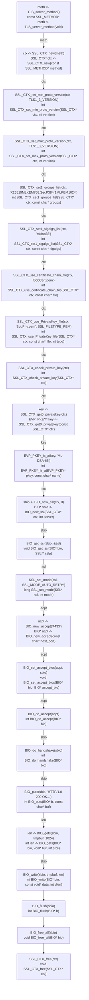

# ch9/pqc/pqc_ssl_server.c

```mermaid
flowchart TD
    A["meth <- TLS_server_method()
const SSL_METHOD* meth <- TLS_server_method(void)"] -->|"meth"| B["ctx <- SSL_CTX_new(meth)
SSL_CTX* ctx <- SSL_CTX_new(const SSL_METHOD* method)"]
    B -->|"ctx"| C["SSL_CTX_set_min_proto_version(ctx, TLS1_3_VERSION)
int SSL_CTX_set_min_proto_version(SSL_CTX* ctx, int version)"]
    C -->|"ctx"| D["SSL_CTX_set_max_proto_version(ctx, TLS1_3_VERSION)
int SSL_CTX_set_max_proto_version(SSL_CTX* ctx, int version)"]
    D -->|"ctx"| E["SSL_CTX_set1_groups_list(ctx, 'X25519MLKEM768:SecP384r1MLKEM1024')
int SSL_CTX_set1_groups_list(SSL_CTX* ctx, const char* groups)"]
    E -->|"ctx"| F["SSL_CTX_set1_sigalgs_list(ctx, 'mldsa65')
int SSL_CTX_set1_sigalgs_list(SSL_CTX* ctx, const char* sigalgs)"]
    F -->|"ctx"| G["SSL_CTX_use_certificate_chain_file(ctx, 'BobCert.pem')
int SSL_CTX_use_certificate_chain_file(SSL_CTX* ctx, const char* file)"]
    G -->|"ctx"| H["SSL_CTX_use_PrivateKey_file(ctx, 'BobPriv.pem', SSL_FILETYPE_PEM)
int SSL_CTX_use_PrivateKey_file(SSL_CTX* ctx, const char* file, int type)"]
    H -->|"ctx"| I["SSL_CTX_check_private_key(ctx)
int SSL_CTX_check_private_key(SSL_CTX* ctx)"]
    I -->|"ctx"| J["key <- SSL_CTX_get0_privatekey(ctx)
EVP_PKEY* key <- SSL_CTX_get0_privatekey(const SSL_CTX* ctx)"]
    J -->|"key"| K["EVP_PKEY_is_a(key, 'ML-DSA-65')
int EVP_PKEY_is_a(EVP_PKEY* pkey, const char* name)"]
    K -->|"ctx"| L["sbio <- BIO_new_ssl(ctx, 0)
BIO* sbio <- BIO_new_ssl(SSL_CTX* ctx, int server)"]
    L -->|"sbio"| M["BIO_get_ssl(sbio, &ssl)
void BIO_get_ssl(BIO* bio, SSL** sslp)"]
    M -->|"ssl"| N["SSL_set_mode(ssl, SSL_MODE_AUTO_RETRY)
long SSL_set_mode(SSL* ssl, int mode)"]
    N -->|"acpt"| O["acpt <- BIO_new_accept('4433')
BIO* acpt <- BIO_new_accept(const char* host_port)"]
    O -->|"acpt"| P["BIO_set_accept_bios(acpt, sbio)
void BIO_set_accept_bios(BIO* bio, BIO* accept_bio)"]
    P -->|"acpt"| Q["BIO_do_accept(acpt)
int BIO_do_accept(BIO* bio)"]
    Q -->|"sbio"| R["BIO_do_handshake(sbio)
int BIO_do_handshake(BIO* bio)"]
    R -->|"sbio"| S["BIO_puts(sbio, 'HTTP/1.0 200 OK...')
int BIO_puts(BIO* b, const char* buf)"]
    S -->|"len"| T["len <- BIO_gets(sbio, tmpbuf, 1024)
int len <- BIO_gets(BIO* bio, void* buf, int size)"]
    T -->|"sbio"| U["BIO_write(sbio, tmpbuf, len)
int BIO_write(BIO* bio, const void* data, int dlen)"]
    U --> V["BIO_flush(sbio)
int BIO_flush(BIO* b)"]
    V --> W["BIO_free_all(sbio)
void BIO_free_all(BIO* bio)"]
    W --> X["SSL_CTX_free(ctx)
void SSL_CTX_free(SSL_CTX* ctx)"]
```
