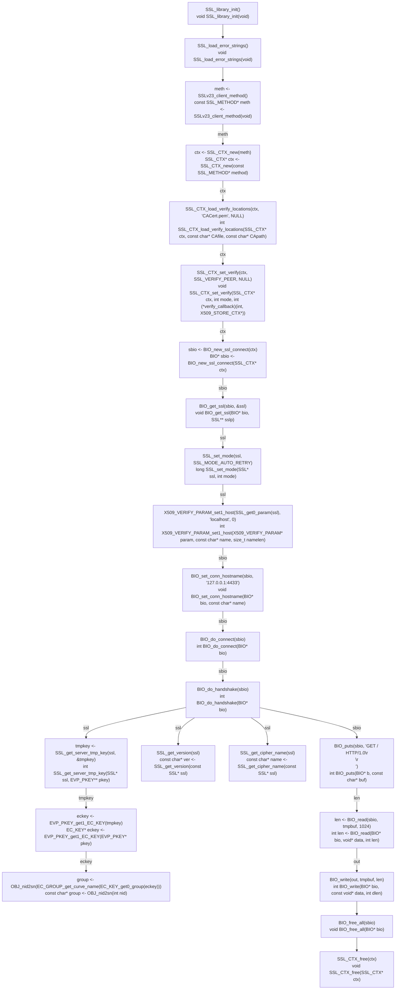

# ch9/ssl_client.c

```mermaid
flowchart TD
    A["SSL_library_init()
void SSL_library_init(void)"] --> B["SSL_load_error_strings()
void SSL_load_error_strings(void)"]
    B --> C["meth <- SSLv23_client_method()
const SSL_METHOD* meth <- SSLv23_client_method(void)"]
    C -->|"meth"| D["ctx <- SSL_CTX_new(meth)
SSL_CTX* ctx <- SSL_CTX_new(const SSL_METHOD* method)"]
    D -->|"ctx"| E["SSL_CTX_load_verify_locations(ctx, 'CACert.pem', NULL)
int SSL_CTX_load_verify_locations(SSL_CTX* ctx, const char* CAfile, const char* CApath)"]
    E -->|"ctx"| F["SSL_CTX_set_verify(ctx, SSL_VERIFY_PEER, NULL)
void SSL_CTX_set_verify(SSL_CTX* ctx, int mode, int (*verify_callback)(int, X509_STORE_CTX*))"]
    F -->|"ctx"| G["sbio <- BIO_new_ssl_connect(ctx)
BIO* sbio <- BIO_new_ssl_connect(SSL_CTX* ctx)"]
    G -->|"sbio"| H["BIO_get_ssl(sbio, &ssl)
void BIO_get_ssl(BIO* bio, SSL** sslp)"]
    H -->|"ssl"| I["SSL_set_mode(ssl, SSL_MODE_AUTO_RETRY)
long SSL_set_mode(SSL* ssl, int mode)"]
    I -->|"ssl"| J["X509_VERIFY_PARAM_set1_host(SSL_get0_param(ssl), 'localhost', 0)
int X509_VERIFY_PARAM_set1_host(X509_VERIFY_PARAM* param, const char* name, size_t namelen)"]
    J -->|"sbio"| K["BIO_set_conn_hostname(sbio, '127.0.0.1:4433')
void BIO_set_conn_hostname(BIO* bio, const char* name)"]
    K -->|"sbio"| L["BIO_do_connect(sbio)
int BIO_do_connect(BIO* bio)"]
    L -->|"sbio"| M["BIO_do_handshake(sbio)
int BIO_do_handshake(BIO* bio)"]
    M -->|"ssl"| N["tmpkey <- SSL_get_server_tmp_key(ssl, &tmpkey)
int SSL_get_server_tmp_key(SSL* ssl, EVP_PKEY** pkey)"]
    N -->|"tmpkey"| O["eckey <- EVP_PKEY_get1_EC_KEY(tmpkey)
EC_KEY* eckey <- EVP_PKEY_get1_EC_KEY(EVP_PKEY* pkey)"]
    O -->|"eckey"| P["group <- OBJ_nid2sn(EC_GROUP_get_curve_name(EC_KEY_get0_group(eckey)))
const char* group <- OBJ_nid2sn(int nid)"]
    M -->|"ssl"| Q["SSL_get_version(ssl)
const char* ver <- SSL_get_version(const SSL* ssl)"]
    M -->|"ssl"| R["SSL_get_cipher_name(ssl)
const char* name <- SSL_get_cipher_name(const SSL* ssl)"]
    M -->|"sbio"| S["BIO_puts(sbio, 'GET / HTTP/1.0\r\n\r\n')
int BIO_puts(BIO* b, const char* buf)"]
    S -->|"len"| T["len <- BIO_read(sbio, tmpbuf, 1024)
int len <- BIO_read(BIO* bio, void* data, int len)"]
    T -->|"out"| U["BIO_write(out, tmpbuf, len)
int BIO_write(BIO* bio, const void* data, int dlen)"]
    U --> V["BIO_free_all(sbio)
void BIO_free_all(BIO* bio)"]
    V --> W["SSL_CTX_free(ctx)
void SSL_CTX_free(SSL_CTX* ctx)"]
```
