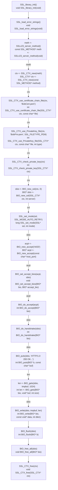

# ch9/ssl_server.c

```mermaid
flowchart TD
    A["SSL_library_init()
void SSL_library_init(void)"] --> B["SSL_load_error_strings()
void SSL_load_error_strings(void)"]
    B --> C["meth <- SSLv23_server_method()
const SSL_METHOD* meth <- SSLv23_server_method(void)"]
    C -->|"meth"| D["ctx <- SSL_CTX_new(meth)
SSL_CTX* ctx <- SSL_CTX_new(const SSL_METHOD* method)"]
    D -->|"ctx"| E["SSL_CTX_use_certificate_chain_file(ctx, 'BobCert.pem')
int SSL_CTX_use_certificate_chain_file(SSL_CTX* ctx, const char* file)"]
    E -->|"ctx"| F["SSL_CTX_use_PrivateKey_file(ctx, 'BobPriv.pem', SSL_FILETYPE_PEM)
int SSL_CTX_use_PrivateKey_file(SSL_CTX* ctx, const char* file, int type)"]
    F -->|"ctx"| G["SSL_CTX_check_private_key(ctx)
int SSL_CTX_check_private_key(SSL_CTX* ctx)"]
    G -->|"ctx"| H["sbio <- BIO_new_ssl(ctx, 0)
BIO* sbio <- BIO_new_ssl(SSL_CTX* ctx, int server)"]
    H -->|"ssl"| I["SSL_set_mode(ssl, SSL_MODE_AUTO_RETRY)
long SSL_set_mode(SSL* ssl, int mode)"]
    I -->|"sbio"| J["acpt <- BIO_new_accept('4433')
BIO* acpt <- BIO_new_accept(const char* host_port)"]
    J -->|"acpt"| K["BIO_set_accept_bios(acpt, sbio)
void BIO_set_accept_bios(BIO* bio, BIO* accept_bio)"]
    K -->|"acpt"| L["BIO_do_accept(acpt)
int BIO_do_accept(BIO* bio)"]
    L -->|"sbio"| M["BIO_do_handshake(sbio)
int BIO_do_handshake(BIO* bio)"]
    M -->|"sbio"| N["BIO_puts(sbio, 'HTTP/1.0 200 OK...')
int BIO_puts(BIO* b, const char* buf)"]
    N -->|"len"| O["len <- BIO_gets(sbio, tmpbuf, 1024)
int len <- BIO_gets(BIO* bio, void* buf, int size)"]
    O -->|"sbio"| P["BIO_write(sbio, tmpbuf, len)
int BIO_write(BIO* bio, const void* data, int dlen)"]
    P --> Q["BIO_flush(sbio)
int BIO_flush(BIO* b)"]
    Q --> R["BIO_free_all(sbio)
void BIO_free_all(BIO* bio)"]
    R --> S["SSL_CTX_free(ctx)
void SSL_CTX_free(SSL_CTX* ctx)"]
```
